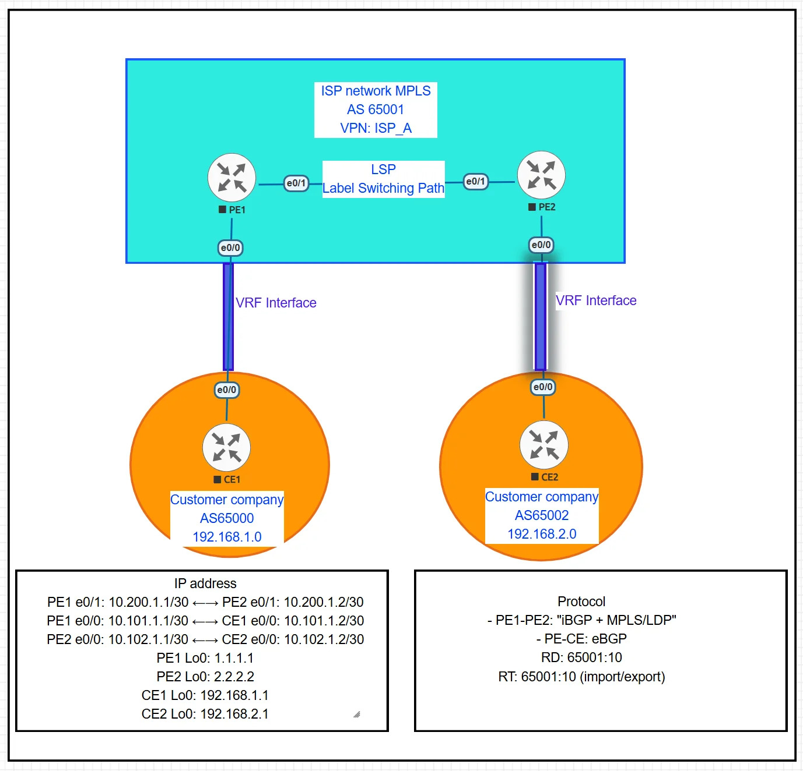

# MPLS BGP VPN (Standard)



## Summary

Standard MPLS L3VPN configuration with PE-CE BGP routing. Two customer sites with different AS numbers (AS 65000 and AS 65002) communicate through ISP MPLS backbone using VRF isolation and MP-BGP VPNv4.

## Lab Environment

**Emulation Platform:**
- Hypervisor: VMware Workstation Pro
- Network Emulator: EVE-NG Community Edition
- Base OS: Ubuntu 22.04 LTS
- Router Platform: Cisco IOL (IOS on Linux)
- IOS Version: 15.x

**Topology:**
See topology.png for network diagram and device connections.

All configurations have been tested and verified in this environment.

## 📁 Lab Files

[Download 1MPLS-STD-VPN.unl](https://raw.githubusercontent.com/mikio-abe/network-lab-02-mpls-bgp-vpn-standard/main/1MPLS-STD-VPN.unl)

Click the link above to download the complete EVE-NG lab topology file.

## Configuration Files:
- [CE1.cfg](https://raw.githubusercontent.com/mikio-abe/network-lab-02-mpls-bgp-vpn-standard/main/CE1.cfg) - Customer Edge 1 (AS 65000)
- [CE2.cfg](https://raw.githubusercontent.com/mikio-abe/network-lab-02-mpls-bgp-vpn-standard/main/CE2.cfg) - Customer Edge 2 (AS 65002)
- [PE1.cfg](https://raw.githubusercontent.com/mikio-abe/network-lab-02-mpls-bgp-vpn-standard/main/PE1.cfg) - Provider Edge 1 (VRF + MP-BGP + MPLS)
- [PE2.cfg](https://raw.githubusercontent.com/mikio-abe/network-lab-02-mpls-bgp-vpn-standard/main/PE2.cfg) - Provider Edge 2 (VRF + MP-BGP + MPLS)

  
## Verification

```
show ip bgp vpnv4 vrf ISP_A
show mpls forwarding-table
ping vrf ISP_A 192.168.2.1 source 192.168.1.1
```

**Blog:** [Medium Article](https://medium.com/@miki2013smp/ai-assisted-mpls-vpn-learning-from-standard-configuration-to-production-scenarios-9f8a88b4c2c3)
